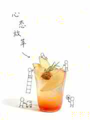
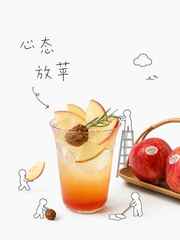

# Minimal Doodle Product Poster Skill

极简留白 × 真实产品摄影 × 无脸微缩小人 × 稚拙细线中文的可复用 AI 生图 Skill。

> 这套视觉常被口语化称为“喜茶风”，但本项目使用中性的可迁移语言描述它：**Minimal Product Photography + Doodle Micro-Storytelling**。目标不是复刻某个品牌，而是提炼一种可复用的视觉方法。

## v0.3 核心升级

从“一个很长的 Prompt”升级为“工作流 + 专项规则 + 评估测试”。

```text
上传照片
→ 锁定真实主体
→ 提炼产品特征
→ 生成微缩工作动作
→ 选择 Quick / Fidelity 模式
→ 生成海报
→ 按 Evaluation 规则验收
```

## 风格公式

```text
70%–80% 白色留白
+ 单一真实摄影主体
+ 居中偏下构图
+ 黑色稚拙线稿
+ 4–5 个无脸圆头微缩小人
+ 产品相关动作叙事
+ 稚拙、松散、细黑线中文
= 安静、清爽、治愈、有故事感的产品海报
```

## 两种生成模式

### Quick Mode

适合快速测试。主体、小人和文字一次生成。

### Fidelity Mode

当用户强调主体还原或字体像参考时使用：

1. 先生成无文字 Poster Base；
2. 单独生成 Lettering Layer；
3. 最后合成。

这样修改字体时，不会重新洗掉主体、小人和构图。

## 实测对比｜苹果冰茶「心态放苹」

| 原图 | Version 1 · Quick Mode | Version 2 · Fidelity Mode |
|---|---|---|
|  |  |  |
| 实拍照片作为 Subject Lock 基准。 | 一次完成海报，验证整体风格能否快速成立。 | 强化红苹果与苹果切片，让标题中的“苹”与主体关系更直接。 |

完整测试记录见 [`examples/apple-tea-test.md`](examples/apple-tea-test.md)。

## 实测对比｜3 组本人实拍照片

本轮继续测试不同复杂度的真实照片，并为 Fidelity Mode 指定统一目标：**强调画面中最大的核心元素**。


| Case | Quick Mode | Fidelity Mode |
|---|---|---|
| 蔬菜农场 | 保留多个角色与蔬菜关系，故事更丰富。 | 锁定巨型红番茄为第一视觉中心。 |
| 米奇海鲜汤 | 保留整碗食材丰富度。 | 强化中央黄色米奇造型食材。 |
| 焦糖饼干冰淇淋 | 饼干、冰淇淋、焦糖共同叙事。 | 放大焦糖饼干作为最强形状锚点。 |

完整测试记录见 [`examples/three-case-comparison.md`](examples/three-case-comparison.md)。

## 最重要的 5 条规则

1. **Subject Lock**：先确认“它是什么”，再做创意。布丁不能因为“蓝色 + 清凉”被改成刨冰。
2. **Photography First**：真实产品摄影永远是第一视觉锚点，不做全图卡通化。
3. **Worker ≠ Decoration**：每个小人必须有产品相关工作，不能为了热闹随机加人。
4. **Fixed Figure System**：圆头、无五官、无表情、无发型、无服饰、无标签，只靠动作表达。
5. **Lettering Is a System**：目标不是“手写字体贴图”，而是稚拙字形骨架 + 细黑线笔画 + 松散构图。

## 推荐输入

只给一张照片也可以。更稳定时可补充：

```yaml
subject: 蓝色布丁
feature: 清凉、Q弹、奶油、樱桃
caption: 清甜下午茶
worker_count: 4
color_palette: 浅蓝、奶油白、樱桃红、黑、白
mode: quick | fidelity
```

## 文件结构

```text
minimal-doodle-product-poster-skill/
├── README.md
├── SKILL.md
├── ASSET-NOTICE.md
├── references/
│   ├── style-guide.md
│   ├── subject-fidelity.md
│   ├── micro-worker-guide.md
│   ├── lettering-guide.md
│   └── evaluation.md
├── prompts/
│   ├── quick-prompt.md
│   ├── poster-base.md
│   └── lettering-layer.md
├── evals/
│   └── evals.json
├── assets/examples/
│   ├── apple-tea/
│   └── three-case-comparison.svg
└── examples/
    ├── watermelon.md
    ├── blue-pudding.md
    ├── apple-tea-test.md
    └── three-case-comparison.md
```

## 当前测试结论

- 西瓜案例验证了“产品特征 → 微缩工作”的叙事逻辑。
- 蓝色布丁案例暴露并修复了“主体漂移”：布丁曾被错误转成刨冰。
- 蓝色布丁第二轮验证了固定小人系统：圆头、无脸、无服饰。
- “清甜下午茶”测试暴露了字体需要独立控制字形骨架，而不能只堆“手写感”形容词。
- 苹果冰茶测试验证了 Quick / Fidelity 两条路径，并发现 Fidelity Mode 应强化标题中的核心产品语义。
- 三组本人实拍测试进一步验证：Quick Mode 更擅长保留完整故事，Fidelity Mode 在指定 `dominant element` 后更容易形成明确视觉中心。

## 发布边界

仓库不默认包含官方品牌 Logo、吉祥物、包装标识或未经授权的第三方参考图。本人拍摄并明确允许用于测试展示的素材可作为回归案例保留。具体见 `ASSET-NOTICE.md`。

## 当前版本

**v0.3 — Modular Workflow**

下一阶段目标：继续用不同品类实拍图做回归测试，并把失败案例沉淀进 `evals/evals.json`。