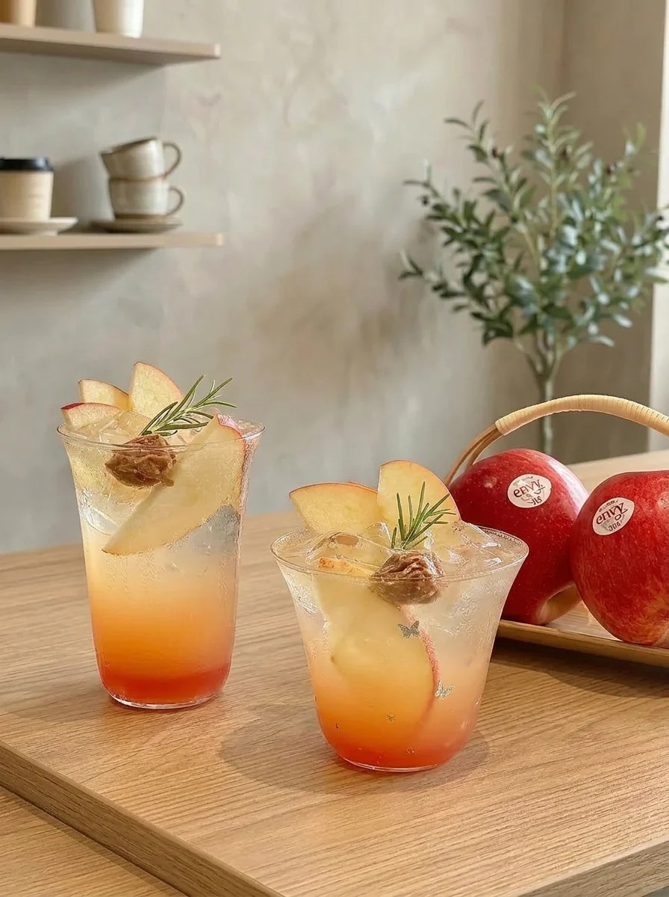
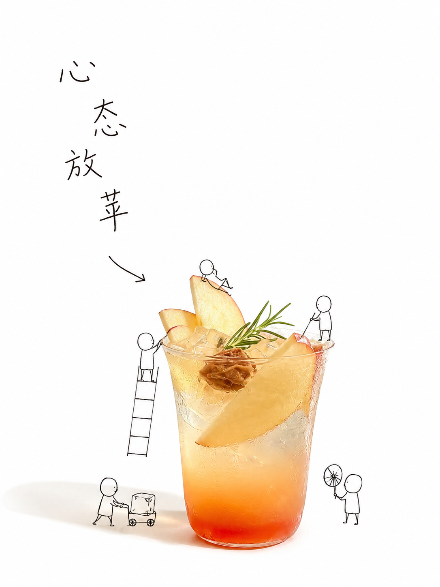

# Minimal Doodle Product Poster Skill

**真实产品摄影 × 极简留白 × 无脸微缩小人 × 稚拙细线中文** 的可复用 AI 生图 Skill。

> 这套视觉常被口语化称为“喜茶风”。项目采用中性描述 **Minimal Product Photography + Doodle Micro-Storytelling**：提炼可迁移、可测试、可迭代的方法，而不是复刻任何品牌。

## What It Does

把一张真实产品、食物、饮品或日常物件照片，转译成一张以摄影主体为主角的极简海报：

```text
大面积白色留白
+ 保留可识别的真实摄影主体
+ 黑色极简微缩小人
+ 与产品特征相关的动作故事
+ 可选的稚拙、松散、细黑线中文
```

核心原则：**摄影主体负责“是什么”，小人负责“它有什么特点”。**

## Generation Modes

| 模式 | 适用时机 | 目标 |
|---|---|---|
| **Quick Mode** | 第一次探索、快速测试 | 一次建立主体、故事与标题 |
| **Fidelity Mode** | 已明确需要保护或加强的单一属性 | 在不推翻已接受结构的前提下做针对性修正 |

```yaml
mode: fidelity
fidelity_focus: subject_identity | dominant_element | lettering
```

Fidelity Mode 使用三层锁定：Subject Lock（它是什么）、Scene Lock（靠什么认出原场景）与 Focus Lock（这一轮第一视觉信号是什么）。一轮只处理一个 Focus。

## Example · Apple Tea「心态放苹」

| Original | Quick Mode | Fidelity Mode |
|---|---|---|
|  |  |  |
| 输入基准：两杯苹果冰茶、苹果切片、冰块、迷迭香与黄橙红渐变饮品。 | 一次建立摄影主体、微缩工作与标题。 | 在保留苹果与双杯场景线索的基础上，对指定 Focus 做单项强化。 |

[查看完整测试记录 →](examples/apple-tea-test.md)

## 3-Case Experiment · Original × Quick × Fidelity

三组实验比较复杂展陈、复合餐品和单一甜品：Quick Mode 先建立完整故事；Fidelity Mode · `dominant_element` 则把最有意义的元素重新确立为第一视觉中心。


| Case | Quick Mode | Fidelity · `dominant_element` |
|---|---|---|
| 蔬菜农场 | 保留更多场景关系，故事更丰富。 | 锁定巨型红番茄为第一视觉中心。 |
| 海鲜汤 | 保留整碗食材丰富度。 | 强化中央黄色造型食材。 |
| 焦糖饼干冰淇淋 | 饼干、冰淇淋与焦糖共同叙事。 | 强化焦糖饼干这一最强形状锚点。 |

[查看完整 3 组实验记录 →](examples/three-case-comparison.md)

## Workflow

```text
上传照片 → Subject Lock → 必要时 Scene Lock
→ 提炼 2–4 个真实产品特征 → 转译为 3–5 个微缩工作动作
→ Quick / Fidelity → Fidelity 选择单一 Focus → 生成 → Evaluation 验收
```

## Non-Negotiable Rules

1. **Subject Lock**：先确认“它是什么”，再做创意；感官概念不能覆盖产品身份。
2. **Photography First**：产品保持真实摄影材质，不把整张图卡通化。
3. **Scene Lock**：复杂照片仅保留 1–3 个有识别价值的场景线索。
4. **Worker ≠ Decoration**：每个小人都要对应产品特征和清晰动作。
5. **Fixed Figure System**：圆头、无五官、无表情、无发型、无服饰、无标签；只用姿态和工具表达。
6. **Lettering Is a System**：文字应稚拙、松散、细黑线、略歪；不用标准字体、工整书法或圆润可爱字体。
7. **One Fidelity Focus per Pass**：主体、焦点与字体分轮修正。

## Repository Structure

```text
minimal-doodle-product-poster-skill/
├── README.md
├── SKILL.md
├── assets/examples/
│   ├── apple-tea/
│   │   ├── source-original.jpg
│   │   ├── quick-mode-original.png
│   │   └── fidelity-mode-original.png
│   └── three-case-comparison-original.png
└── examples/
    ├── apple-tea-test.md
    └── three-case-comparison.md
```

## Asset & Brand Notice

示例仅用于展示工作流。项目不默认包含官方品牌 Logo、吉祥物、包装标识或未经授权的第三方素材；使用自己的测试素材前，请确认拥有相应权利。详见 [`ASSET-NOTICE.md`](ASSET-NOTICE.md)。
