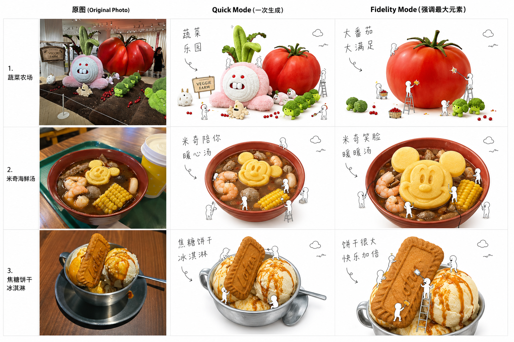

# Three-Case Comparison — Original × Quick × Fidelity

三组不同复杂度的输入，展示 Quick Mode 如何建立完整故事，以及 Fidelity Mode · `dominant_element` 如何重新安排视觉优先级。



## How to Read the Board

每一行都是同一输入的三段对照：左侧是原始照片，中间是一次生成的 Quick Mode，右侧是选择 `dominant_element` 后的 Fidelity Mode。右列并不是创造新产品，而是在原有类别、材质和关键结构仍可识别的前提下，让最有意义的元素先被看到。

## Experiment Matrix

| Case | Original | Quick Mode | Fidelity · `dominant_element` |
|---|---|---|---|
| **01 · 蔬菜农场** | 巨型红番茄、粉色角色与绿色蔬菜同时形成高密度展陈。 | 保留多个场景关系，转译为白底微缩工作世界；信息完整但焦点分散。 | 锁定巨型红番茄；仅保留少量蔬菜作为 Scene Lock，小人首先服务番茄。 |
| **02 · 海鲜汤** | 深色汤底中有虾、玉米、丸子等配料；中央黄色造型食材最易识别。 | 保留整碗丰富度，小人分散在不同配料附近，强调完整餐品故事。 | 放大并居中强化黄色造型食材，让它先于汤底和其他配料被识别。 |
| **03 · 焦糖饼干冰淇淋** | 金属碗、冰淇淋、焦糖酱与竖直饼干共同构成主体；饼干是形状锚点。 | 保留饼干、冰淇淋与焦糖的完整关系，整体信息更均衡。 | 提升焦糖饼干的尺度与位置，冰淇淋和焦糖退居第二层。 |

## What This Comparison Shows

### Quick Mode

适合第一次探索。它倾向于保留更多输入信息，快速建立摄影主体、微缩动作故事和手写标题。优势是叙事完整、验证快；风险是复杂原图会稀释第一视觉中心。

### Fidelity Mode · `dominant_element`

适合已经知道“哪个元素必须最先被看见”的情况。它先锁定主体类别和必要场景线索，再选择单一 Focus，最后削弱次要元素并让小人围绕焦点工作。

```text
Subject Lock → Scene Lock → Focus Lock: dominant_element
→ 削弱次要元素 → 小人优先服务核心元素
```

这不是任意把画面简化成一个新物体，而是在维持原始类别、摄影材质与关键结构的条件下，重新建立层级。

## Key Findings

1. **选择最大且有意义的元素。** 不应把背景建筑、桌面或墙面当作 Fidelity Focus。
2. **复杂照片需要 Scene Lock。** 保留 1–3 个关键线索，比完整复制原图更能让白底海报成立。
3. **Quick 与 Fidelity 的差异是视觉优先级。** Quick 建立完整故事；Fidelity 解决明确的单项问题。
4. **小人始终是辅助者。** 产品摄影是第一主角，小人负责解释和放大特征。
5. **标题和小人独立验收。** 如果其中任一系统失控，应切换对应的 Fidelity Focus，而不是无差别重做整张图。
